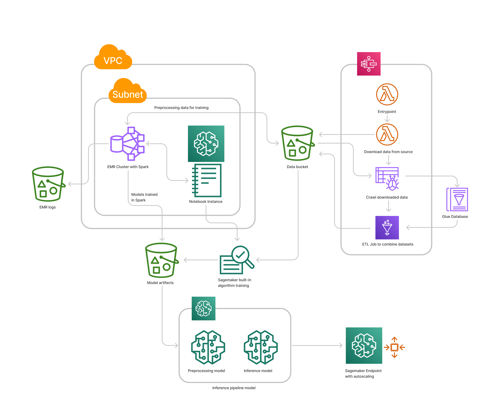

# AIML Blackbelt Capstone: SageMaker + Spark 
This repository holds my capstone project submission for the AWS Partner Network AI/ML Blackbelt Program.
For more information on this program, see [here](https://github.com/aboavent/ai-ml-bb-2021).
The goal of the capstone is to show domain knowledge in AWS' machine learning suite,
as well as how to integrate and work effectively with SageMaker and Spark.

To demonstrate this, we were provided the task of 
creating an end-to-end machine learning solution to accurately predict flight delays.
For the official prompt, see [here](https://github.com/aboavent/ai-ml-bb-2021/blob/main/capstone-project/SageMaker%20%2B%20Spark.md)

The following datasets were used to that end:
* [Bureau of Transportation Statistics' airline flight statistics](https://www.transtats.bts.gov/Fields.asp?gnoyr_VQ=FGJ),
* [NOAA's weather and station data](https://www1.ncdc.noaa.gov/pub/data/ghcn/daily/),
* [OpenFlights airport data](https://openflights.org/data.html).

## Porject structure
This project consists of three main components:

    1. A data and ETL pipeline,
    2. The development environment required to interact with SageMaker and Spark,
    3. SageMaker notebooks to train, test, and deploy models.

The first two compenents are implemented in the AWS CDK for Python, 
which produces (among other artifacts) AWS Cloudformation Templates.
Note that the stacks for the data pipeline and development environment are distinct.

Once these resources are deployed and created,
we may then run the SageMaker notebooks (found in the `notebooks` directory) 
on the SageMaker Notebook Instance generated by the development enviroment stack.
All SageMaker training jobs, models, and endpoints are created and deployed via these notebooks.

Below is a diagram of the resulting the cloud architecture.

## Deploying and running
This project requires the AWS CDK for Python as well as Docker.

To deploy the necessary infrastructure, the following commands are used:
* `cdk bootstrap` Initialize assets before deployment.
* `cdk synth`     Generates the CloudFormation templates locally (useful for inspecting before deploying).
* `cdk deploy`    Deploy this stack to your default AWS account and region.

Note that the Docker daemon must be running when calling `cdk synth` or `cdk deploy`
so the Lambda Function bundles can be built.

Once created, find the Step Function generated by this project and run.
This will download all historic data necessary for any analysis.

After this is complete, you are ready to go through the notebooks.
These notebooks are sequential, with some data and resources generated in earlier notebooks being used in later ones.
It is required that they are executed in order.
